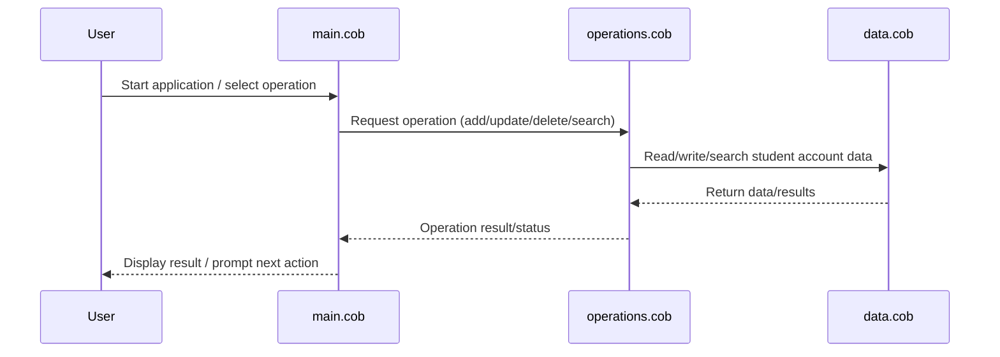

# COBOL Student Accounts Modernization

This project contains legacy COBOL code for managing student accounts. The documentation below describes the purpose of each COBOL file, key functions, and business rules implemented in the system.

## File Overview

### `main.cob`
- **Purpose:** Entry point for the COBOL application. Handles program initialization, user interaction, and coordinates calls to other modules.
- **Key Functions:**
  - Program start and termination routines
  - Menu display and user input handling
  - Delegates operations to `operations.cob` based on user choices
- **Business Rules:**
  - Ensures only valid operations are presented to the user
  - Handles error messages and program flow control

### `operations.cob`
- **Purpose:** Contains core business logic for student account management.
- **Key Functions:**
  - Add, update, and delete student accounts
  - Process payments and adjustments
  - Validate account data and enforce business rules
- **Business Rules:**
  - Student accounts must have unique IDs
  - Payments cannot exceed outstanding balances
  - Only authorized operations are permitted

### `data.cob`
- **Purpose:** Manages data storage and retrieval for student accounts.
- **Key Functions:**
  - Read and write student account records
  - Search for accounts by ID or name
  - Maintain data integrity during updates
- **Business Rules:**
  - All account changes are logged
  - Data validation is performed before updates
  - Ensures consistency between in-memory and persisted data

## Business Rules Summary
- Student accounts require unique identifiers
- Payments and adjustments are validated against account balances
- All changes are logged for audit purposes
- Only authorized users can perform sensitive operations

---
For further details, refer to the source code in `/src/cobol/`.

---

## Sequence Diagram: Student Account Data Flow

